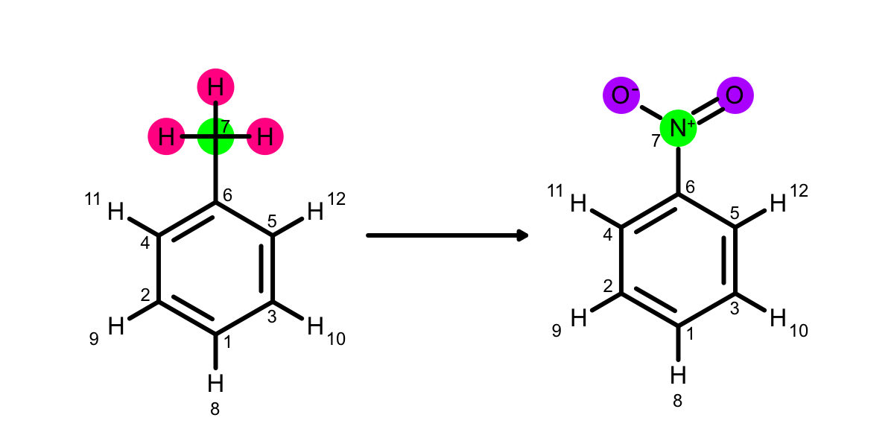
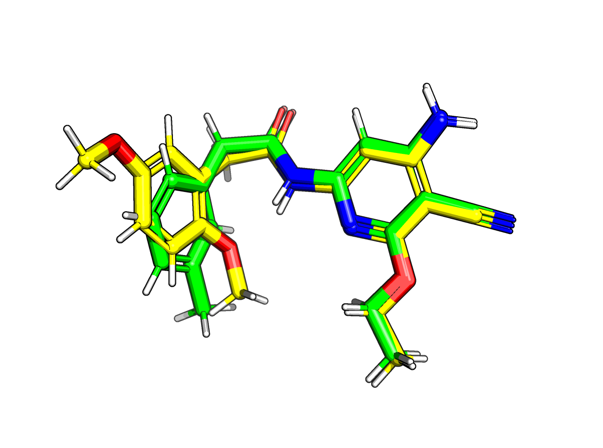
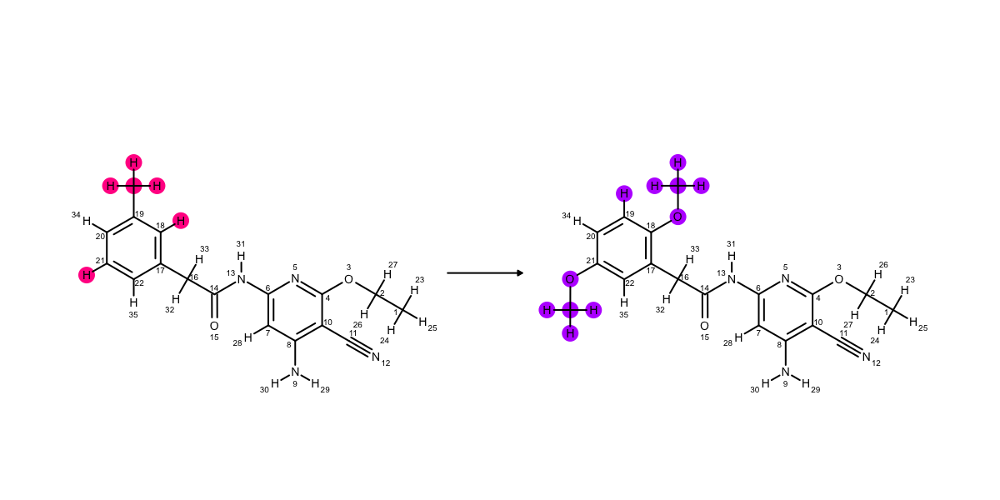

.. _examples:

Examples
********

All examples are located in ``perses/examples``. These are designed to demonstrate the functionality of perses, and are hopefully a good starting point to be adapted to other projects.

.. note:: If anything is unclear or incorrect, please open an Issue_.

..
  abl-src-selectivity

Atom Mapping
++++++++++++
This example demonstrates some of the possible exposed options that can be used when generating a hybrid topology. What the **best** hybrid topology is for a simulation is an open research question.

If you go from toluene to phenol, should the methyl carbon be 'mapped' onto the phenol oxygen and therefore be in the core? Or should they be both be unique atoms?

First, the mapping is illustrated with some SMILES molecules of some small aromatic molecules.

PINK shows unique-old atoms and PURPLE shows unique-new. These atoms will be switched off and on respectively across an alchemical protocol. GREEN indicates core atoms that are changing element.

Look at the toluene to nitrobenzene example:

The carbon is mapped onto the nitrogen. How could they be removed from the mapping? adding 'AtomicNumber' to ``atom_expr`` is one option, or 'FormalCharge' would work if you would want a methyl group to map onto a amine group but not a nitro.

It's worth playing around with these options and seeing what works best for your particular project before committing lots of compute.

The next section uses Bace to demonstrate it on a few ligands. A few pairs of ligands are chosen, and the maps using IntType for atoms and RingMember for bonds. IntType is special in perses, as by default, it's used to represent the size of the rings that an atom is in. Try setting atom_type to 0 and see what the maps look like. It's unlikely that a simulation using this map would perform well.

The next section uses two Jnk1 ligands to demonstrate two different sorts of mapping strategy. The first uses 'core'. This returns the map that puts the most atoms in the core - so that the overlap between ligand A and ligand B is maximized. Most cases, this is the best thing to do, however maximizing the overlap might not be the best if the ligands don't overlap in **space**.

   Ligands 0 (green) and 1 (yellow) for Jnk1 shown in 3D space. Notice that the meta substitutions (methyl and ether groups respectively) point in different directions. These may not interconvert through rotations in the active site.

You can see above that the methyl group and the ether group point in different directions, which corresponds to different binding modes in the active site. Now lets look at the 'core' mapping strategy (which is the default). The O and the C are mapped (i.e. green). We can try stop them mapping like before (using AtomicNumber), but they're always going to map coming off carbon 19. This is because having the hydrogen 22 mapped is maximizing the number of atoms in the core.

.. figure:: images/core.png
   :width: 500

   This is the mapping when the default 'core' strategy is used.

To get the geometry right, we want to have fewer atoms in the core, so try the mapping strategy 'geometry'. This will use the coordinates of the molecule to pick the best map. If they did point the same direction in the active site, it would return the same map as core anyway --- try ligand indices 0 and 6 to see this. Geometry is `only` going to work if the geometry associated with the ligands is meaningful. With these Jnk1 ligands, we have the molecules aligned as they should be in the active site.

   This is the mapping when the 'geometry' strategy is used. This is `only` useful if the binding mode of the second ligand is known.

The way the 'geometry' strategy works, is by getting the scaffolds of the molecules, and enumerating all the ways that they fit onto each other to enumerate the 'symmetry'. This method of using the scaffolds allows us to spot rotatable aromatic rings or alternative orientations without hydrogens adding to the score making only one orientation preferable.

These symmetry scaffold pairs are then used as restraints to find as many maps as possible --- look at the final two maps --- the whole molecule has been flipped around as the symmetry has identified the pattern where the molecule is inverted around the carbonyl. The ``geometry score`` is the sum of cartesian distances between mapped atoms. The best geometry score (of 9) is for the one that recapitulates the input best. The worst score (~111) where the whole molecule is flipped is very far from the binding pose, but could be an interesting experiment to run if we had no idea of the binding pose for ligand B.

Sampler Example
+++++++++++++++

This folder contains an example setup for a protein-ligand relative free energy calculation for ligands bound to CDK2. The input files in this directory are from the Schrodinger JACS dataset (publication [#]_ and input files [#]_ ), with the protein pdb fixed using PDBFixer.

This example demonstrates how the free energy can be calculated using different sampler methods: REPEX, SAMS and nonequilibrium switching. Notice that the ``fe_type`` in each of these differ.

The ``.yaml`` files in each case contain input parameters for the simulations. Each of these contains a pair of ligand IDs that correspond to the molecule index in the ligand input file ``CDK2_ligands_shifted.sdf``.

.. note:: The ligand input is zero-indexed.

Look at the files and see which parameters are used for each free energy method type. The ``neq_splitting`` is only defined in ``cdk2_nonequilibrium.yaml``, as it's specific to non-equilibrium sampling.

The example can be run by calling ``perses-relative cdk2_sams.yaml``. By default, the included yaml file directs the code to set up and run the complex, solvent and vacuum phase.

The yaml file only sets up a pairwise comparison for two ligands. To run a range of ligands, change the ``ligand_pairs`` in run.py to those of interest. This will then copy the input yaml to make individual yaml files per pair.

To submit the job on a LSF cluster, use ``submit-ligpairs.sh``, to change the jobarray so that it is the same length of the list of ligand pairs.

Use ``bsub < submit-ligpairs.sh`` (if on LSF, or adapt as appropriate).

..
  freesolv

..
  host-guest

..
  mcl1-example

..
  neq-switching

..
  relay-example

..
  rjmc

..
  thrombin_fah_generator

.. _Issue: https://github.com/choderalab/perses/issues/new
Python_ is `my favourite
programming language`__.

References
----------

.. [#] `Accurate and Reliable Prediction of Relative Ligand Binding Potency in Prospective Drug Discovery by Way of a Modern Free-Energy Calculation Protocol and Force Field` Lingle Wang et al. JACS 137:2695, 2017.

.. [#] `Input files are here <https://drive.google.com/drive/u/1/folders/0BylmDElgu6QLTnJ2WGMzNXBENkk>`_.
